# Java Swing jdbc搭配MySQL 建立簡易商城系統

## 使用技術
- java jdk11
- Swing
- MySQL 8.0.41
- eclipse windowbuilder
- dao pattern
- jdbc

# 使用方式

## 前置條件

- 安裝mysql8.0.41
[MySQL Community Downloads](https://dev.mysql.com/downloads/installer/)

- 安裝jdk11
[jdk-11.0.25_windows-x64_bin](https://www.oracle.com/tw/java/technologies/javase/jdk11-archive-downloads.html)

## 下載本專案對應檔案

下載SQL import數據庫及表格，在sql資料夾

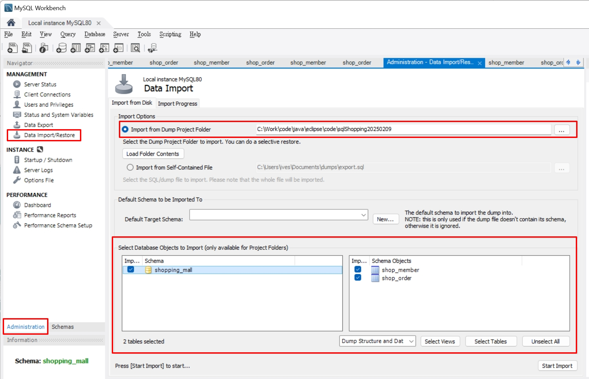

下載OrderAppV400.jar

[OrderAppV400.jar](https://github.com/IvesShe/JavaSwingMySQLShoppingMall/blob/main/OrderAppV400.jar)

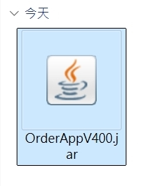

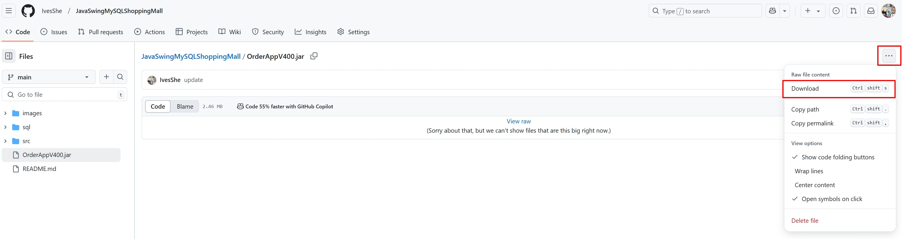

windows環境直接雙擊OrderAppV400.jar，即可執行

mac環境要開啟終端機，輸入

```shell
java -jar OrderAppV400.jar
```

原始碼在src資料夾，僅供參考

# 登入畫面

一般帳號只能查到自己的訂單, admin帳號可以查到所有的訂單(帳號admin,密碼123)

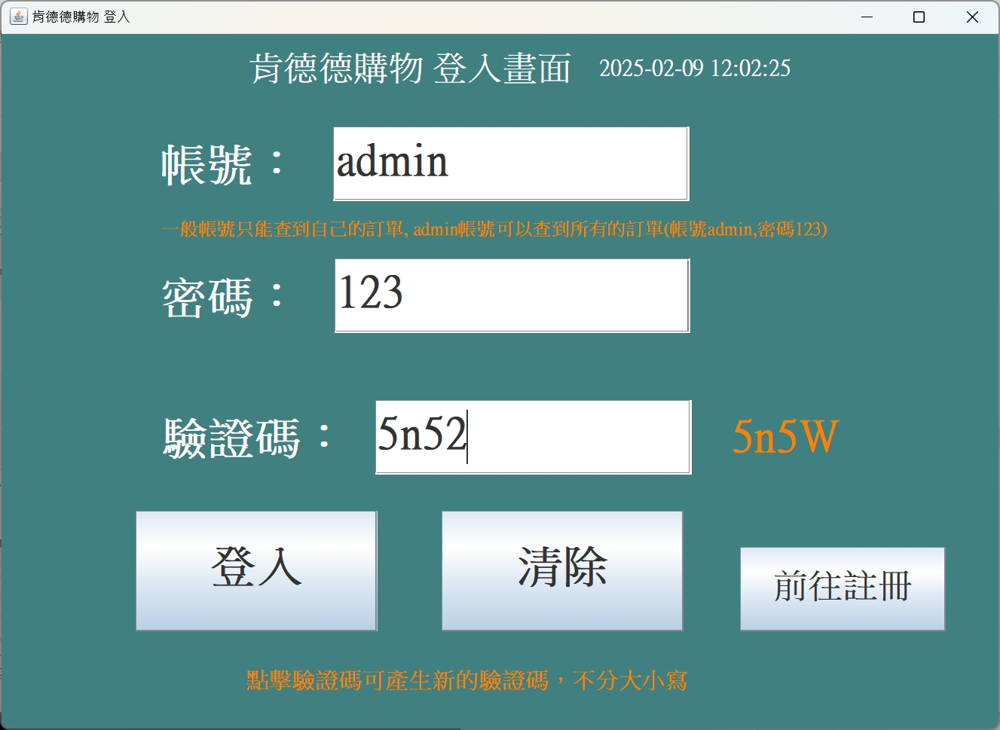

# 登入成功歡迎畫面

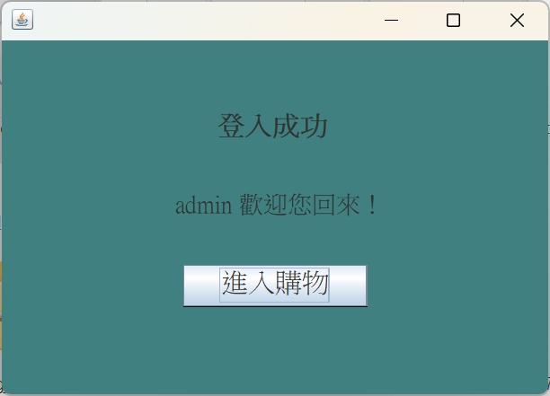

# 訂單主頁

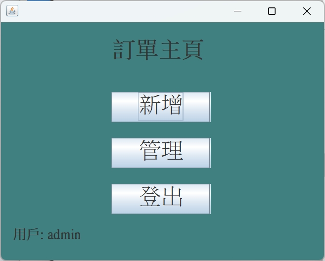

# 訂單新增畫面

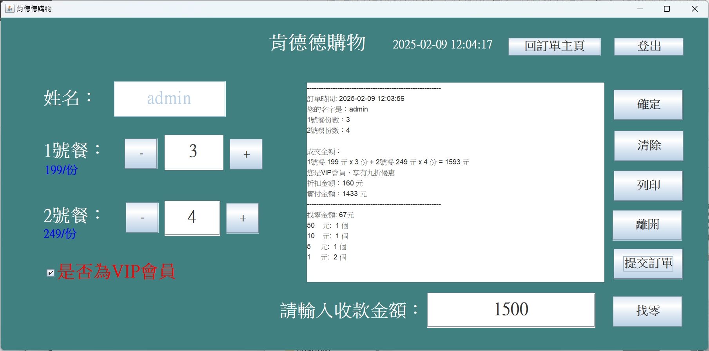

# 訂單管理畫面

## admin帳號可以查到所有的訂單

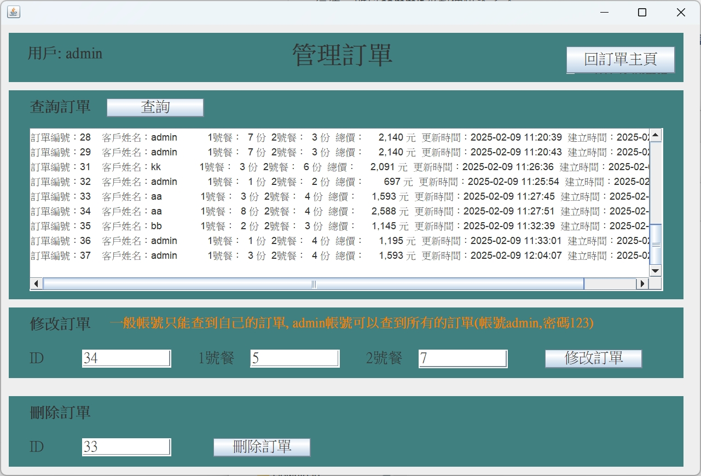

## 一般帳號只能查到自己的訂單

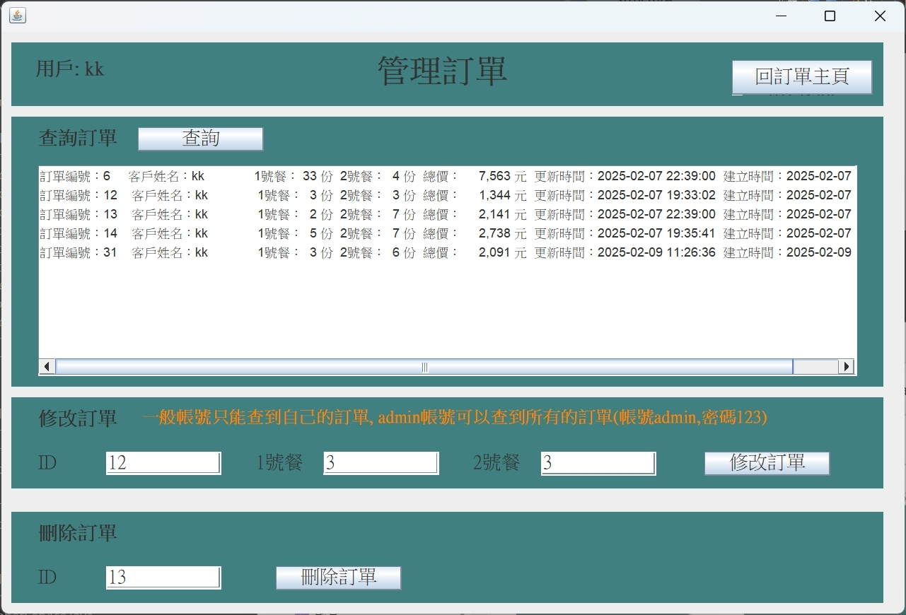

# 註冊畫面

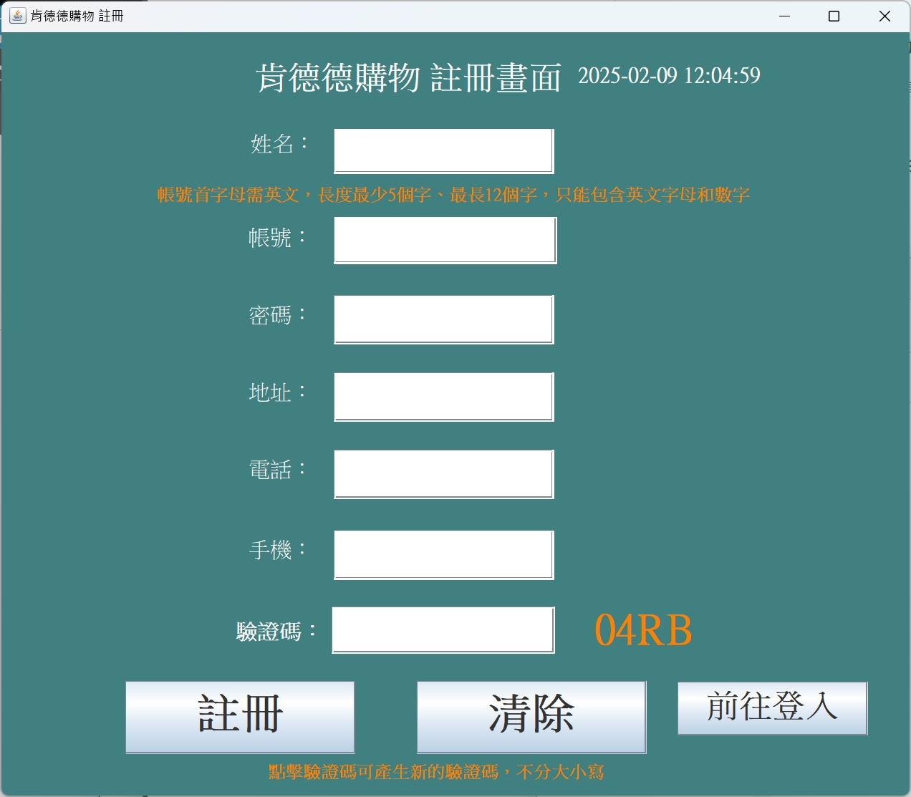

# 註冊失敗畫面


# MySQL

帳號root
密碼1234

## 會員表單

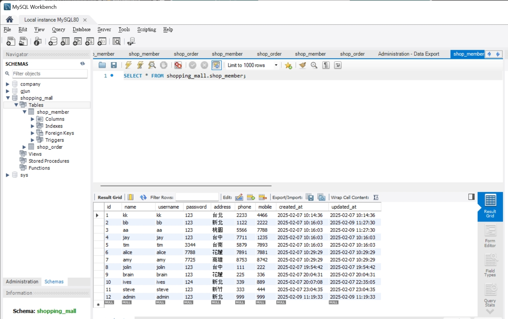

## 訂單表單

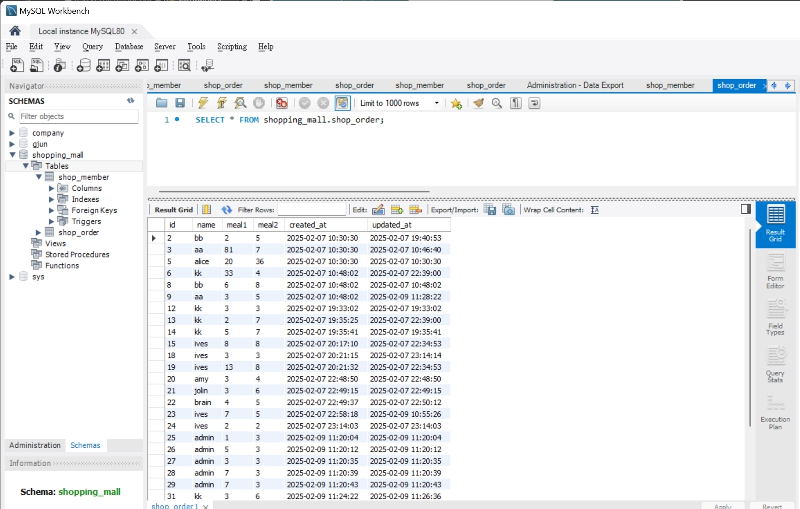


# 其它專案

## [CocosCreatorDemo](https://github.com/IvesShe/CocosCreatorDemo)

# Model

## Member

```java
package model;

import java.io.Serializable;

public class Member implements Serializable{
	/**
	 * 
	 */
	private static final long serialVersionUID = 1L;
	private Integer id;
	private String name;
	private String username;
	private String password;
	private String address;
	private String phone;
	private String mobile;
	
	public Member() {
		super();
	}

	public Member(String name, String username, String password, String address, String phone, String mobile) {
		super();
		this.name = name;
		this.username = username;
		this.password = password;
		this.address = address;
		this.phone = phone;
		this.mobile = mobile;
	}

	public Integer getId() {
		return id;
	}

	public void setId(Integer id) {
		this.id = id;
	}

	public String getName() {
		return name;
	}

	public void setName(String name) {
		this.name = name;
	}

	public String getUsername() {
		return username;
	}

	public void setUsername(String username) {
		this.username = username;
	}

	public String getPassword() {
		return password;
	}

	public void setPassword(String password) {
		this.password = password;
	}

	public String getAddress() {
		return address;
	}

	public void setAddress(String address) {
		this.address = address;
	}

	public String getPhone() {
		return phone;
	}

	public void setPhone(String phone) {
		this.phone = phone;
	}

	public String getMobile() {
		return mobile;
	}

	public void setMobile(String mobile) {
		this.mobile = mobile;
	}
	
	
}


```


## ShopOrder

```java

package model;


import java.sql.Timestamp;
import java.time.LocalDateTime;
import java.time.format.DateTimeFormatter;

public class ShopOrder {
	private Integer id;	

	private String name;
	private Integer mealNo1;
	private Integer mealNo2;
	private Integer sum;
	// 1號餐售價
	static Integer mealNo1Price = 199;
	// 2號餐售價
	static Integer mealNo2Price = 249;
	private Timestamp createdAt;  // 使用 Timestamp 類型
	private Timestamp updatedAt;  // 使用 Timestamp 類型
	
	public ShopOrder() {
		super();
	}
	
	public ShopOrder(String name, Integer mealNo1Price, Integer mealNo2) {
		super();
		this.name = name;
		this.mealNo1 = mealNo1Price;
		this.mealNo2 = mealNo2;
	}
	
	public Integer getId() {
		return id;
	}

	public void setId(Integer id) {
		this.id = id;
	}

	public String getName() {
		return name;
	}

	public void setName(String name) {
		this.name = name;
	}	

	public Integer getMealNo1() {
		return mealNo1;
	}

	public void setMealNo1(Integer mealNo1) {
		this.mealNo1 = mealNo1;
	}

	public Integer getMealNo2() {
		return mealNo2;
	}

	public void setMealNo2(Integer mealNo2) {
		this.mealNo2 = mealNo2;
	}

	public static Integer getMealNo1Price() {
		return mealNo1Price;
	}

	public static void setMealNo1Price(Integer mealNo1Price) {
		ShopOrder.mealNo1Price = mealNo1Price;
	}

	public static Integer getMealNo2Price() {
		return mealNo2Price;
	}

	public static void setMealNo2Price(Integer mealNo2Price) {
		ShopOrder.mealNo2Price = mealNo2Price;
	}

	public Integer getSum() {
		this.sum = this.mealNo1 * ShopOrder.mealNo1Price + this.mealNo2 * ShopOrder.mealNo2Price;
		return sum;
	}
	
	
	
	public Timestamp getCreatedAt() {
		return createdAt;
	}

	public void setCreatedAt(Timestamp createdAt) {
		this.createdAt = createdAt;
	}

	public Timestamp getUpdatedAt() {
		return updatedAt;
	}

	public void setUpdatedAt(Timestamp updatedAt) {
		this.updatedAt = updatedAt;
	}

	public String showOrder(Boolean vipMember) {
		// 取得當前的系統時間
	    LocalDateTime now = LocalDateTime.now();
	    DateTimeFormatter formatter = DateTimeFormatter.ofPattern("yyyy-MM-dd HH:mm:ss");
	    String currentTime = now.format(formatter);
	    
	    String outputMessage = String.format(
	            "---------------------------------------------------------\n" +
	            "訂單時間: %s\n" +  
	            "您的名字是：%s\n" +
	            "1號餐份數：%d\n" +
	            "2號餐份數：%d\n\n" +
	            "成交金額：\n" +
	            "1號餐 %d 元 x %d 份 + 2號餐 %d 元 x %d 份 = %d 元",
	            currentTime,  // 顯示當前時間
	            this.getName(),
	            this.getMealNo1(),
	            this.getMealNo2(),
	            ShopOrder.getMealNo1Price(),
	            this.getMealNo1(),
	            ShopOrder.getMealNo2Price(),
	            this.getMealNo2(),
	            this.getSum()
	    );

	    if (vipMember) {
	        outputMessage += String.format(
	                "\n您是VIP會員，享有九折優惠\n" +
	                "折扣金額：%d 元\n" +
	                "實付金額：%d 元",
	                (this.getSum() - (int)(this.getSum() * 0.9)),
	                (int)(this.getSum() * 0.9)
	        );
	    } else {
	        outputMessage += "\n您是一般會員，無任何優惠";
	    }

	    outputMessage += "\n---------------------------------------------------------";
	    return outputMessage;
	}
	
}

```

# SQL

## shopping_mall_shop_member

```sql 
CREATE DATABASE  IF NOT EXISTS `shopping_mall` /*!40100 DEFAULT CHARACTER SET utf8mb4 COLLATE utf8mb4_0900_ai_ci */ /*!80016 DEFAULT ENCRYPTION='N' */;
USE `shopping_mall`;
-- MySQL dump 10.13  Distrib 8.0.41, for Win64 (x86_64)
--
-- Host: localhost    Database: shopping_mall
-- ------------------------------------------------------
-- Server version	8.0.41

/*!40101 SET @OLD_CHARACTER_SET_CLIENT=@@CHARACTER_SET_CLIENT */;
/*!40101 SET @OLD_CHARACTER_SET_RESULTS=@@CHARACTER_SET_RESULTS */;
/*!40101 SET @OLD_COLLATION_CONNECTION=@@COLLATION_CONNECTION */;
/*!50503 SET NAMES utf8 */;
/*!40103 SET @OLD_TIME_ZONE=@@TIME_ZONE */;
/*!40103 SET TIME_ZONE='+00:00' */;
/*!40014 SET @OLD_UNIQUE_CHECKS=@@UNIQUE_CHECKS, UNIQUE_CHECKS=0 */;
/*!40014 SET @OLD_FOREIGN_KEY_CHECKS=@@FOREIGN_KEY_CHECKS, FOREIGN_KEY_CHECKS=0 */;
/*!40101 SET @OLD_SQL_MODE=@@SQL_MODE, SQL_MODE='NO_AUTO_VALUE_ON_ZERO' */;
/*!40111 SET @OLD_SQL_NOTES=@@SQL_NOTES, SQL_NOTES=0 */;

--
-- Table structure for table `shop_member`
--

DROP TABLE IF EXISTS `shop_member`;
/*!40101 SET @saved_cs_client     = @@character_set_client */;
/*!50503 SET character_set_client = utf8mb4 */;
CREATE TABLE `shop_member` (
  `id` int NOT NULL AUTO_INCREMENT,
  `name` varchar(45) DEFAULT NULL,
  `username` varchar(45) DEFAULT NULL,
  `password` varchar(45) DEFAULT NULL,
  `address` varchar(45) DEFAULT NULL,
  `phone` varchar(45) DEFAULT NULL,
  `mobile` varchar(45) DEFAULT NULL,
  `created_at` timestamp NULL DEFAULT CURRENT_TIMESTAMP,
  `updated_at` timestamp NULL DEFAULT CURRENT_TIMESTAMP ON UPDATE CURRENT_TIMESTAMP,
  PRIMARY KEY (`id`)
) ENGINE=InnoDB AUTO_INCREMENT=13 DEFAULT CHARSET=utf8mb4 COLLATE=utf8mb4_0900_ai_ci;
/*!40101 SET character_set_client = @saved_cs_client */;

--
-- Dumping data for table `shop_member`
--

LOCK TABLES `shop_member` WRITE;
/*!40000 ALTER TABLE `shop_member` DISABLE KEYS */;
INSERT INTO `shop_member` VALUES (1,'kk','kk','123','台北','2233','4466','2025-02-07 02:14:36','2025-02-07 02:14:36'),(2,'bb','bb','123','新北','1122','2222','2025-02-07 02:16:03','2025-02-09 03:27:30'),(3,'aa','aa','123','桃園','5566','7788','2025-02-07 02:16:03','2025-02-09 03:27:30'),(4,'jay','jay','123','台中','7711','1235','2025-02-07 02:16:03','2025-02-07 02:16:03'),(5,'tim','tim','3344','台南','5879','7893','2025-02-07 02:16:03','2025-02-07 02:16:03'),(6,'alice','alice','7788','花蓮','7891','7881','2025-02-07 02:29:29','2025-02-07 02:29:29'),(7,'amy','amy','7725','高雄','8753','8742','2025-02-07 02:29:29','2025-02-07 02:29:29'),(8,'jolin','jolin','123','台中','111','222','2025-02-07 11:54:42','2025-02-07 11:54:42'),(9,'brain','brain','123','花蓮','225','336','2025-02-07 12:04:31','2025-02-07 12:04:31'),(10,'ives','ives','124','新北','339','889','2025-02-07 12:07:08','2025-02-07 14:35:05'),(11,'steve','steve','123','新竹','333','444','2025-02-07 15:04:35','2025-02-07 15:04:35'),(12,'admin','admin','123','新北','999','999','2025-02-09 03:19:33','2025-02-09 03:19:33');
/*!40000 ALTER TABLE `shop_member` ENABLE KEYS */;
UNLOCK TABLES;
/*!40103 SET TIME_ZONE=@OLD_TIME_ZONE */;

/*!40101 SET SQL_MODE=@OLD_SQL_MODE */;
/*!40014 SET FOREIGN_KEY_CHECKS=@OLD_FOREIGN_KEY_CHECKS */;
/*!40014 SET UNIQUE_CHECKS=@OLD_UNIQUE_CHECKS */;
/*!40101 SET CHARACTER_SET_CLIENT=@OLD_CHARACTER_SET_CLIENT */;
/*!40101 SET CHARACTER_SET_RESULTS=@OLD_CHARACTER_SET_RESULTS */;
/*!40101 SET COLLATION_CONNECTION=@OLD_COLLATION_CONNECTION */;
/*!40111 SET SQL_NOTES=@OLD_SQL_NOTES */;

-- Dump completed on 2025-02-09 11:52:15


```

## shopping_mall_shop_order

```sql 
CREATE DATABASE  IF NOT EXISTS `shopping_mall` /*!40100 DEFAULT CHARACTER SET utf8mb4 COLLATE utf8mb4_0900_ai_ci */ /*!80016 DEFAULT ENCRYPTION='N' */;
USE `shopping_mall`;
-- MySQL dump 10.13  Distrib 8.0.41, for Win64 (x86_64)
--
-- Host: localhost    Database: shopping_mall
-- ------------------------------------------------------
-- Server version	8.0.41

/*!40101 SET @OLD_CHARACTER_SET_CLIENT=@@CHARACTER_SET_CLIENT */;
/*!40101 SET @OLD_CHARACTER_SET_RESULTS=@@CHARACTER_SET_RESULTS */;
/*!40101 SET @OLD_COLLATION_CONNECTION=@@COLLATION_CONNECTION */;
/*!50503 SET NAMES utf8 */;
/*!40103 SET @OLD_TIME_ZONE=@@TIME_ZONE */;
/*!40103 SET TIME_ZONE='+00:00' */;
/*!40014 SET @OLD_UNIQUE_CHECKS=@@UNIQUE_CHECKS, UNIQUE_CHECKS=0 */;
/*!40014 SET @OLD_FOREIGN_KEY_CHECKS=@@FOREIGN_KEY_CHECKS, FOREIGN_KEY_CHECKS=0 */;
/*!40101 SET @OLD_SQL_MODE=@@SQL_MODE, SQL_MODE='NO_AUTO_VALUE_ON_ZERO' */;
/*!40111 SET @OLD_SQL_NOTES=@@SQL_NOTES, SQL_NOTES=0 */;

--
-- Table structure for table `shop_member`
--

DROP TABLE IF EXISTS `shop_member`;
/*!40101 SET @saved_cs_client     = @@character_set_client */;
/*!50503 SET character_set_client = utf8mb4 */;
CREATE TABLE `shop_member` (
  `id` int NOT NULL AUTO_INCREMENT,
  `name` varchar(45) DEFAULT NULL,
  `username` varchar(45) DEFAULT NULL,
  `password` varchar(45) DEFAULT NULL,
  `address` varchar(45) DEFAULT NULL,
  `phone` varchar(45) DEFAULT NULL,
  `mobile` varchar(45) DEFAULT NULL,
  `created_at` timestamp NULL DEFAULT CURRENT_TIMESTAMP,
  `updated_at` timestamp NULL DEFAULT CURRENT_TIMESTAMP ON UPDATE CURRENT_TIMESTAMP,
  PRIMARY KEY (`id`)
) ENGINE=InnoDB AUTO_INCREMENT=13 DEFAULT CHARSET=utf8mb4 COLLATE=utf8mb4_0900_ai_ci;
/*!40101 SET character_set_client = @saved_cs_client */;

--
-- Dumping data for table `shop_member`
--

LOCK TABLES `shop_member` WRITE;
/*!40000 ALTER TABLE `shop_member` DISABLE KEYS */;
INSERT INTO `shop_member` VALUES (1,'kk','kk','123','台北','2233','4466','2025-02-07 02:14:36','2025-02-07 02:14:36'),(2,'bb','bb','123','新北','1122','2222','2025-02-07 02:16:03','2025-02-09 03:27:30'),(3,'aa','aa','123','桃園','5566','7788','2025-02-07 02:16:03','2025-02-09 03:27:30'),(4,'jay','jay','123','台中','7711','1235','2025-02-07 02:16:03','2025-02-07 02:16:03'),(5,'tim','tim','3344','台南','5879','7893','2025-02-07 02:16:03','2025-02-07 02:16:03'),(6,'alice','alice','7788','花蓮','7891','7881','2025-02-07 02:29:29','2025-02-07 02:29:29'),(7,'amy','amy','7725','高雄','8753','8742','2025-02-07 02:29:29','2025-02-07 02:29:29'),(8,'jolin','jolin','123','台中','111','222','2025-02-07 11:54:42','2025-02-07 11:54:42'),(9,'brain','brain','123','花蓮','225','336','2025-02-07 12:04:31','2025-02-07 12:04:31'),(10,'ives','ives','124','新北','339','889','2025-02-07 12:07:08','2025-02-07 14:35:05'),(11,'steve','steve','123','新竹','333','444','2025-02-07 15:04:35','2025-02-07 15:04:35'),(12,'admin','admin','123','新北','999','999','2025-02-09 03:19:33','2025-02-09 03:19:33');
/*!40000 ALTER TABLE `shop_member` ENABLE KEYS */;
UNLOCK TABLES;
/*!40103 SET TIME_ZONE=@OLD_TIME_ZONE */;

/*!40101 SET SQL_MODE=@OLD_SQL_MODE */;
/*!40014 SET FOREIGN_KEY_CHECKS=@OLD_FOREIGN_KEY_CHECKS */;
/*!40014 SET UNIQUE_CHECKS=@OLD_UNIQUE_CHECKS */;
/*!40101 SET CHARACTER_SET_CLIENT=@OLD_CHARACTER_SET_CLIENT */;
/*!40101 SET CHARACTER_SET_RESULTS=@OLD_CHARACTER_SET_RESULTS */;
/*!40101 SET COLLATION_CONNECTION=@OLD_COLLATION_CONNECTION */;
/*!40111 SET SQL_NOTES=@OLD_SQL_NOTES */;

-- Dump completed on 2025-02-09 11:52:15


```
